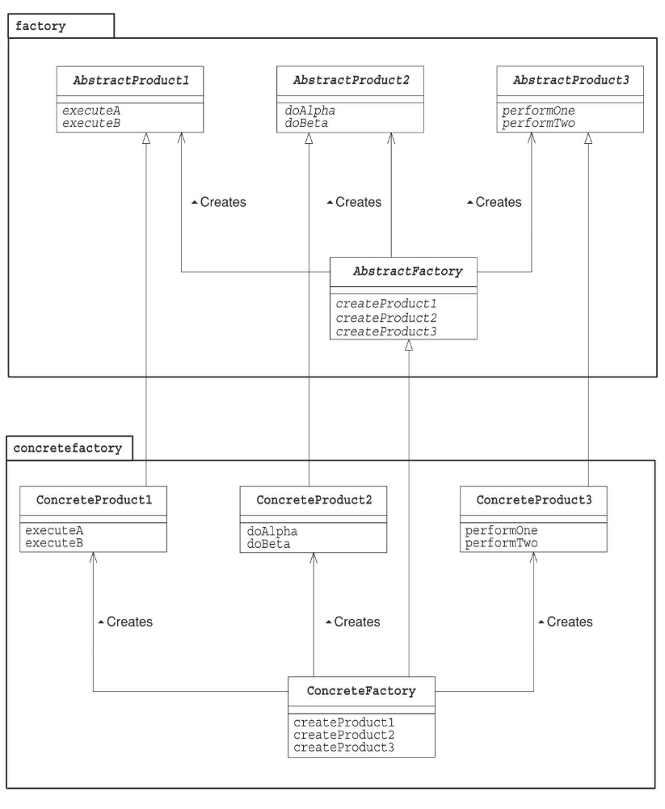

# AbstractFactoryパターン

## メリット

* 抽象的な工場を作ることで、具体的な処理を隠蔽できる。
* 抽象的な工場を作成することで、具体的な工場の切替が容易になる。
* 抽象的な工場で過程から処理まで実装されていることで、具体的な工場が何を実装すればよいかわかりやすい。

## デメリット

* 抽象的な工場で過程から処理まで実装しているので、追加機能を加えることが困難になる。特に、クラスが多い場合は

## クラス図

