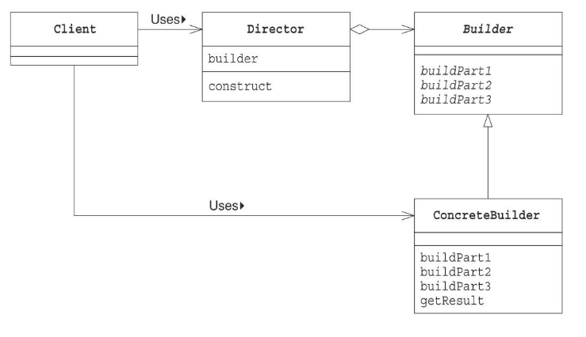
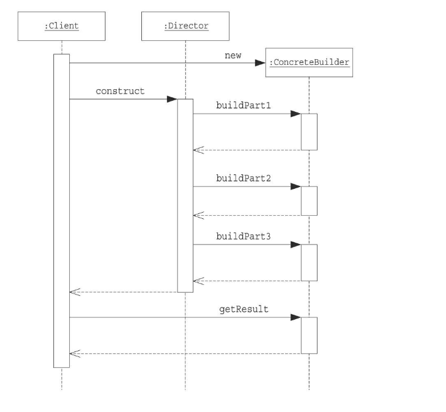

# Builderパターン

## メリット
* 生成過程や生成手段を隠蔽できる
  - directorは生成手段を知ることなく、生成できるので、builderの実装クラスを追加するだけで、生成する処理を増やすことができる。
 
* 生成過程や生成手段を別々のクラスで実装することで、コードの修正と拡張が容易になる
  - directorクラスには生成過程が凝縮
  - builderの実装クラスには生成手段を凝縮

## クラス図

## シーケンス図
 