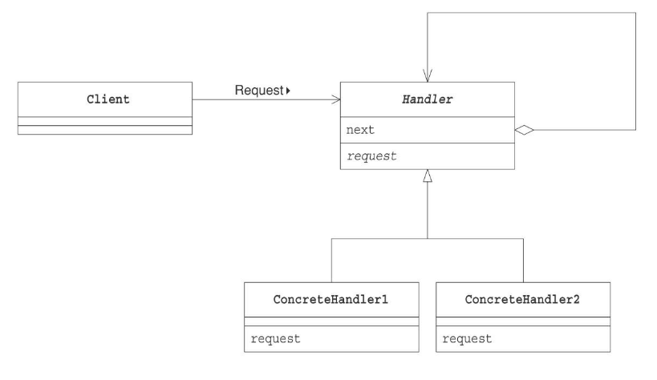
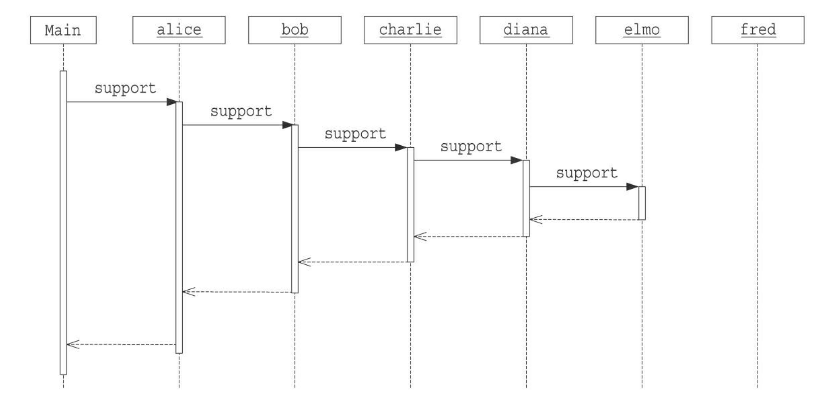

# Chain of Responsibilityパターン

要求を処理するインスタンスを鎖状に並べ、順番にチェックしていくパターン。処理のたらい回し

## メリット

* 要求を出す役(client)と処理する役(contreteHandler)をゆるく結びつける事で、誰が処理をする判定するコードが不要になり、処理する役(concreteHander)の独立性が高くなる。
* 要求を出す役(client)がsetするnextの構成を変えるだけで、動的に処理役の種類を変えることができる。
* 処理する役(contreteHandler)を簡単に追加できる。

## デメリット

* 処理をたらい回しするため、的確のこの処理と決まっている場合に比べて、処理スピードが遅くなる。

## クラス図

## シーケンス図

