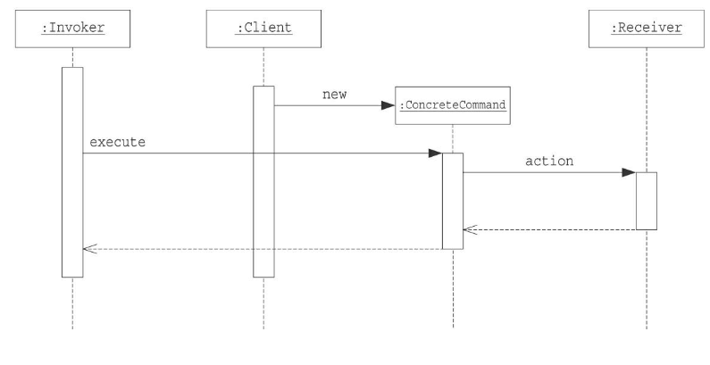

# Commandパターン

命令をクラスに表現して、履歴をとったり、再実行を行ったりすることができる。

## メリット
* 要求の受信と要求の処理を分離していることで、新しい命令クラスを既存のクラスを修正することなく、追加できる。
* 要求の処理(命令クラス)の再利用性を向上させる。受信と処理を分離しているから
* 要求と実行を別々のタイミングで実行できるようになる。
* 履歴をとっておくことで、UndoやRedoをサポートすることができる。

## クラス図

## シーケンス図
