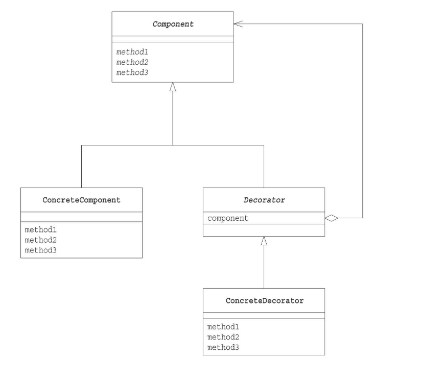

# Decoratorパターン
次々に機能被せていくパターン

## メリット
* concreateComponent(元となる本体)を修正することなく、機能追加ができる。
* 動的な機能追加ができる
* 単純な機能でも、多くの種類を追加することで、多様なパターンを生み出せる
* 機能に順序があり、機能の組み合わせを容易にできる
* concreateComponent(元となる本体)を変更しても、機能に修正を加える必要がない

## デメリット
* 小さいクラス(decoratorの具象クラス)が多く作られてしまう。

## クラス図
