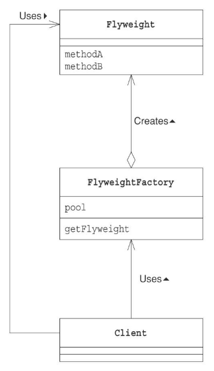

# Flyweightパターン

同じインスタンスを共有することで、無駄をなくす

## メリット
* インスタンスを共有することで、処理スピードが上がる。
* 生成するインスタンスの数を抑えることができる。

## デメリット

* 1つのインスタンスを共有するので、そのインスタンスを書き換えられると使われている箇所すべてが変更される。

## 注意点

共有するインスタンスはどんな状況かでも変化することがない普遍的なインスタンスでないといけない。状況や他のインスタンスの依存関係によって、状態が変化するインスタンスを共有すべきではない。

上記を踏まえて、何を共有するか吟味すること。

## クラス図

