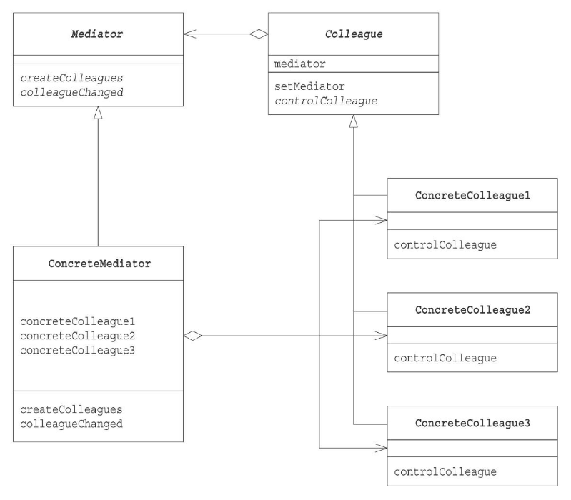

# Mediatorパターン

複雑な処理を相談役が一手に引き受けて、処理をする

## メリット
* 複雑に絡み合うインスタンス郡(colleague)の処理を相談役(Mediator)が一手に引き受けることで、複雑さが緩和され、インスタンス郡のやり取りを明確にできる。
* インスタンス郡(colleague)同士の関係性がゆるくなる。相談役(Mediator)と一対多の関係を築ける。

## デメリット
* インスタンス郡(colleague)は再利用できるが、相談役(Mediator)はクライアントとの依存性が高く、再利用性が低くなる。

## クラス図
