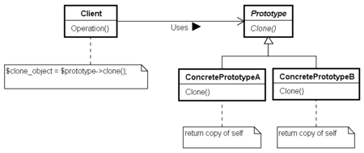

# Prototypeパターン

## メリット

* オブジェクトの生成を隠蔽できる
  - クラスを意識しなくて済む
  - クラス同士の関係がゆるくなる
 
* クラスからインスタンスの生成が難しい時に適用できる
  - ユーザーの操作手順など, 決まった手順ではない時にコピーできる

* 種類が多すぎてクラスにまとめられない場合

## クラス図

## Prototypeパターンの種類

* 浅いコピー
 - 今回のサンプルプログラムは浅いコピーになっている

* 深いコピー
 - __cloneメソッドを呼び出す時に、現在の内容もコピーするようにする。
 - 実装クラスで生成された内容を配列に保存しておき、__cloneメソッドで呼び出すようにすればよい。

