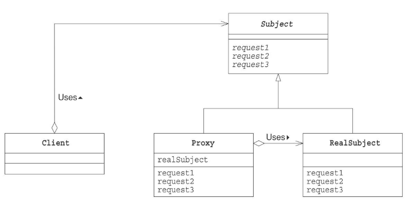

# Proxyパターン

必要になってから作る

## メリット
* 必要になってからインスタンスを作るので、処理スピードが上がる
* client役はRealSubject役に間接的にアクセスすることで、アクセス手段を変化させたり、Proxy役に様々な機能をつけることができる。
* 委譲を使って、プログラムした場合、client役はSubjectクラスのメソッドを意識する必要がない。

## クラス図
