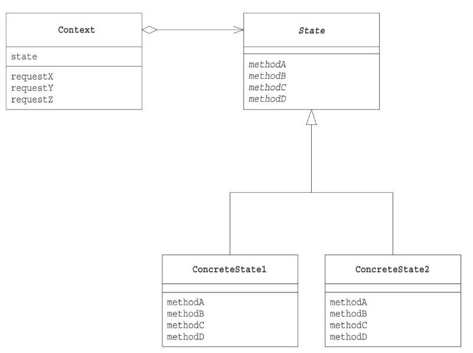

# Stateパターン

状態をクラスで表現して、状態推移を簡潔にする

## メリット
* 条件分岐を多用することなく、複雑な状態変化をクラス分割することで、複雑さを緩和することができる。
* stateの実装クラス(concreteState)の種類が増えれば、増えるほど有効。
* 一つの状態を一つのクラスで表現するので、状態固有の処理を一つのクラスに纏めることができる。
* 状態を判定する条件分岐やswich文がなくなるので、コードの見通しがよくなる。

## クラス図

## シーケンス図(状態推移時)

