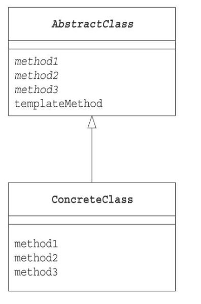

# TemplateMethodパターン

親クラスで一連の処理の骨組みを組み、サブクラスで実装するパターン

### メリット
* 共通処理をまとめることができる。
* アルゴリズムを一元管理するので、修正が容易にできる。
* サブクラスによって、実装を変更できる。

### 補足情報
PHP 5.4.0以上ではtraitを使って実装することができる。
サンプルプログラムでは、traitなしの実装内容になっている。

### クラス図

