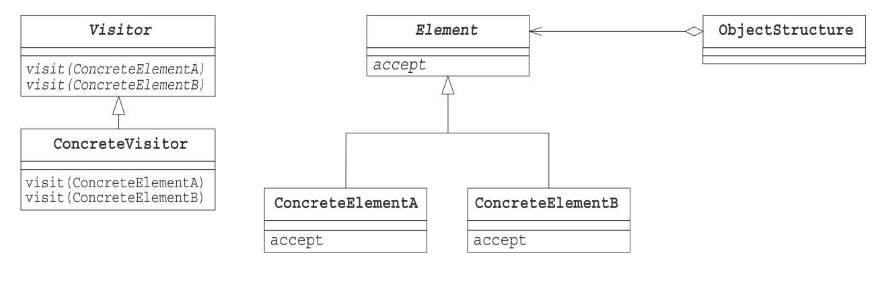
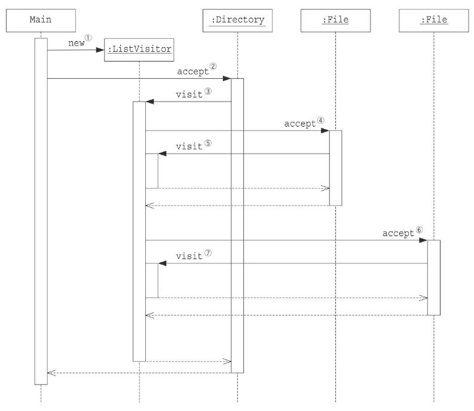

# Visitorパターン

データ構造が保持している要素を渡り歩きながら、処理を施す。

## メリット

* 操作(visior役)をデータ構造を分離して記述することができ、データ構造の修正なく、処理を切り替えることができる。つまり、データ構造の独立性を高めることができる。
*  データ構造を修正することなく、visitor役を追加できる。
* データ構造を変わらないまま、操作だけを変えたいときに有効なパターン

## デメリット
* データ構造(composite役)に機能を追加するのが、困難になる。

## クラス図

## シーケンス図

サンプルプログラミングのaccep()の処理の流れ

